# Домашнее задание по тулингу

## Использование браузерных DevTools - анализ lifehacker.ru

Анализ загрузки сайта `lifehacker.ru` в Chrome DevTools 
по вкладкам Network, Performance, Coverage.

### Анализ

Выполнил ряд условия до анализа сайта:

- Перешел по url [https://lifehacker.ru][https://lifehacker.ru];
- Перешел в режим инкогнито;
- Отключил кэш на вкладке Network (Disable cache - true).

#### На вкладке Network

Записал и сохранил в [HAR архив](profiles/lifehacker.ru.har) профиль загрузки ресурсов при открытии
страницы (Предварительно очистил профиль через флаг Clear 
и установил флаг Preserve log для сохранения журнала).

Провел анализ неоптимальных мест в har.

##### Дублирование ресурсов

2 раза выполняется запрос [https://lifehacker.ru/api/wp/v2/posts/1077477&_embed](https://lifehacker.ru/api/wp/v2/posts/1077477&_embed),
который возвращает одинаковые
данные, рис. 1
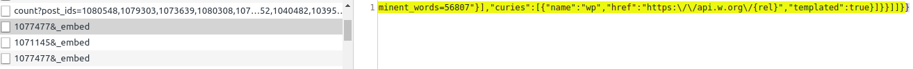
Рисунок 1

2 раза выполняется запрос [https://views.lifehacker.ru/get/](https://views.lifehacker.ru/get/)
который возвращает одинаковые
данные, рис. 2
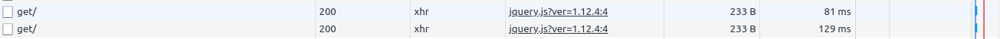

3 раза скачивается файл `adfox-adx-stub.js` рис. 3
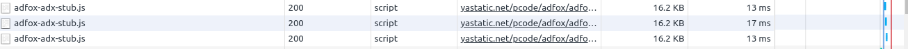

5 раз скачивается файл `adsbygoogle.js`, рис. 4
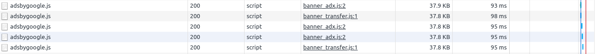

3 раза скачался файл `cookie.js`, рис. 5
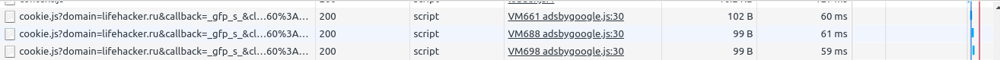

5 раз скачался файл `integrator.js`, рис. 6
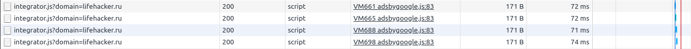

4 раз скачался файл `osd.js`, рис. 7
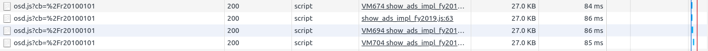

2 раза скачался файл `publishertag.js`, рис. 8
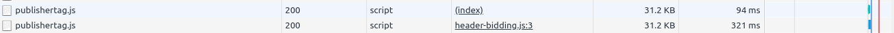

4 раза скачался файл `show_ads_impl_fy2019.js`, рис. 9
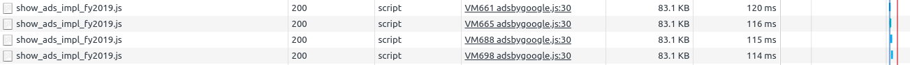

2 раза скачивается изображение, рис 10
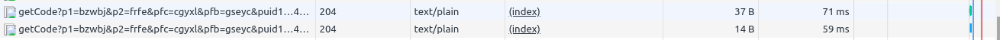

3 раза скачивается файла `adfox-adx-stub.html`, 2 раза `zrt_lookup.html`, рис 11
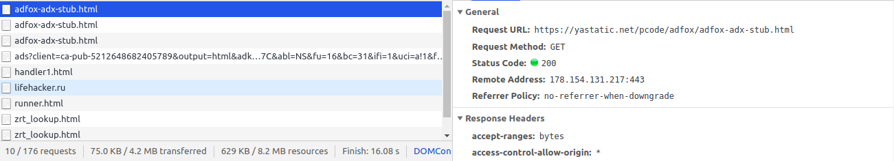

Лишний размер ресурса у файла `oblozhka-2_1584027252.jpg`, его можно сжать, рис 12
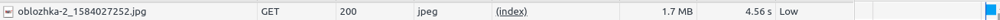

##### Лишний размер ресурса

##### Медленно загружающиеся ресурсы

Относительно долго загружаются изображения `1-3_1582816576.jpg` - 4.95 сек.,
 `oblozhka-2_1584027252.jpg` - 4.56 сек, рис 13. 1 изображение вести в 3 раза
 меньше 2-го, но по времени, загружается почти столько же.
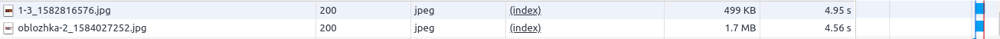

##### Ресурсы, блокирующие загрузку 

#### На вкладке Performance

Записал в файл [профиль](profiles/Profile-20200319T005429.json) загрузки страницы
(Предварительно очистил профиль через флаг Clear).

Измерил время от начала навигации до основных событий:

- До First Paint - 3541.6 мс;
- До First Meaningful Paint - 4474.8 мс;
- До DOM Content Loaded - 4783.4 мс;
- До Load - 11207.8 мс.

Измерил время разных этапов обработки документа:

- Loading - 58 мс;
- Scripting - 2000 мс;
- Rendering - 979 мс;
- Painting - 252 мс.

#### На вкладке Coverage

Измерил кол-во неиспользованного css и js в ходе загрузки страницы, рис 13

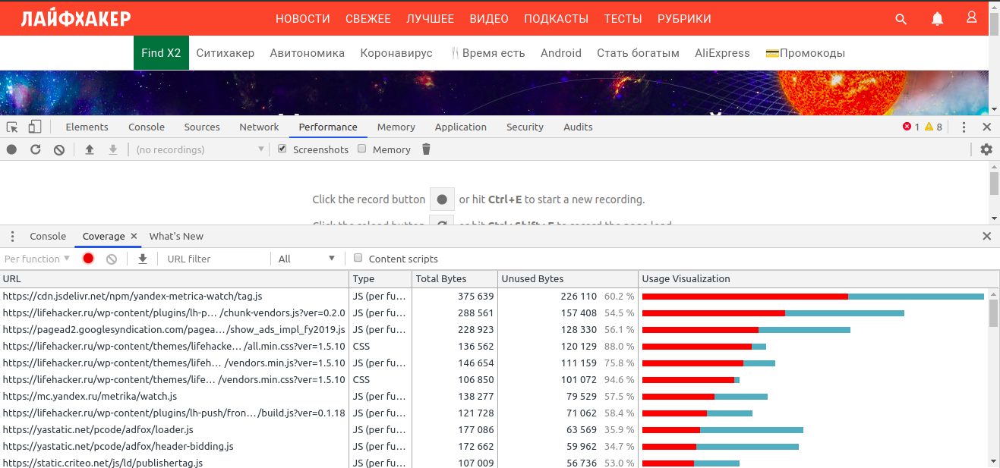

- CSS - `387 kb` не используется из `439 kb` (`52 kb (12 %)` используется);
- JS - `1400 kb` не используется из `2800 kb` (`1400 kb (50 %)` используется).

### Анализ c CPU 4x slowdown и Slow 3G

#### На вкладке Network

Записал и сохранил в [HAR архив](profiles/lifehacker.ru.3g.cpu4x.har) профиль загрузки ресурсов при открытии
страницы (Предварительно очистил профиль через флаг Clear,
установил флаг Preserve log для сохранения журнала, выбрал сеть Slow 3G, в настройках включил
experiments, выставил CPU 4x).

Провел анализ неоптимальных мест в har.

##### Дублирование ресурсов

Дублируются те же ресурсы, что и при анализе выше.

##### Лишний размер ресурса

##### Медленно загружающиеся ресурсы

Изображения, которые загружались долго, стали загружаться напорядок дольше, рис 14

##### Ресурсы, блокирующие загрузку 

#### На вкладке Performance

Записал в файл [профиль](profiles/Profile-20200319T005429.json) загрузки страницы
(Предварительно очистил профиль через флаг Clear).

Измерил время от начала навигации до основных событий:

- До First Paint - 9589 мс;
- До First Meaningful Paint -  9589.8 мс;
- До DOM Content Loaded -  22379 мс;
- До Load -  117840 мс.

Измерил время разных этапов обработки документа:

- Loading -  73 мс;
- Scripting -  3137 мс;
- Rendering -  1385 мс;
- Painting -  724 мс.

#### На вкладке Coverage

Кол-во неиспользованного css и js в ходе загрузки страницы такое же
как и в предыдущем анализе.

[https://lifehacker.ru]: https://lifehacker.ru